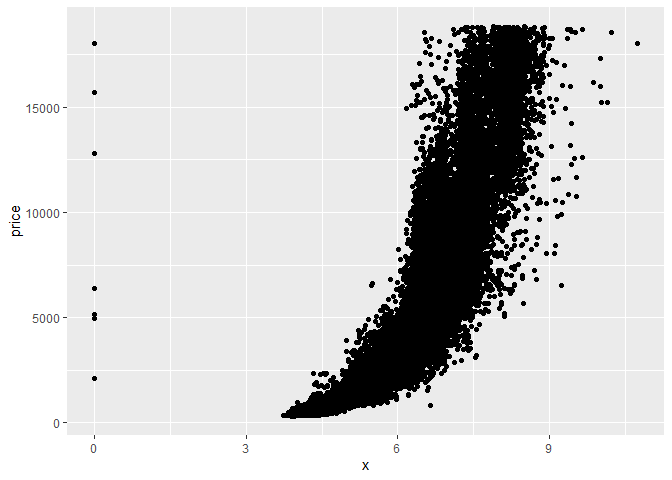

# Preamble


The aim of this notes is to get familiar with grammar of graphics to make use of ggplot2. We shall look at the following aspects
   
   1) Obtaining graph
   2) Modifying Aesthetics
   3) Faceting
   


## ggplot2    
ggplot2 is one of the packages which comes with tidyverse([A package for Data Science](https://rpubs.com/Thinklabz/intro_to_tidyverse)) 
The purpose of visualization is getting insight about data. Data visualization have made simple using ggplot2.   
ggplot2 works based on the idea called grammar of graphics, which means we have to consider following components while creating plots.
   
   1) Data   
   Dataset which we use
   2) Aesthetics   
   Customising look and feel
   3) Geometry   
   Scaling the plot in a way that it displays data better
   4) Facet   
   Grouping data based on various characteristics so that individual impacts are determined
   
We shall look at how to visualize data using examples.
For this let us Consider broad data types
   
   1) Metric data
   2) Categorical data
   
   We shall see how to make beautiful visualizations based on data
     

We need to install and load ggplot2 package  


```r
library(ggplot2)
```

## Dataset used
ggplot2 package have a data called diamonds, let us use the data for visualization

```r
data("diamonds", package = "ggplot2") 
```
The data provides prices of over 50,000 round cut diamonds


<table class="table table-striped" style="width: auto !important; margin-left: auto; margin-right: auto;">
<caption>Glimpse of diamonds data</caption>
 <thead>
  <tr>
   <th style="text-align:left;"> Variable </th>
   <th style="text-align:left;"> Description </th>
   <th style="text-align:left;"> Type </th>
  </tr>
 </thead>
<tbody>
  <tr>
   <td style="text-align:left;"> price </td>
   <td style="text-align:left;"> price of diamond in US dollars (\$326–\$18,823) </td>
   <td style="text-align:left;"> Numeric </td>
  </tr>
  <tr>
   <td style="text-align:left;"> carat </td>
   <td style="text-align:left;"> weight of the diamond (0.2–5.01) </td>
   <td style="text-align:left;"> Numeric </td>
  </tr>
  <tr>
   <td style="text-align:left;"> cut </td>
   <td style="text-align:left;"> quality of the cut </td>
   <td style="text-align:left;"> Str </td>
  </tr>
  <tr>
   <td style="text-align:left;"> color </td>
   <td style="text-align:left;"> diamond colour, from D (best) to J (worst) </td>
   <td style="text-align:left;"> Str </td>
  </tr>
  <tr>
   <td style="text-align:left;"> clarity </td>
   <td style="text-align:left;"> a measurement of how clear the diamond is (I1 (worst), SI2, SI1, VS2, VS1, VVS2, VVS1, IF (best)) </td>
   <td style="text-align:left;"> Str </td>
  </tr>
  <tr>
   <td style="text-align:left;"> x </td>
   <td style="text-align:left;"> length in mm (0–10.74) </td>
   <td style="text-align:left;"> Numeric </td>
  </tr>
  <tr>
   <td style="text-align:left;"> y </td>
   <td style="text-align:left;"> width in mm (0–58.9) </td>
   <td style="text-align:left;"> Numeric </td>
  </tr>
  <tr>
   <td style="text-align:left;"> z </td>
   <td style="text-align:left;"> depth in mm (0–31.8) </td>
   <td style="text-align:left;"> Numeric </td>
  </tr>
  <tr>
   <td style="text-align:left;"> depth </td>
   <td style="text-align:left;"> total depth percentage = z / mean(x, y) = 2 * z / (x + y) (43–79) </td>
   <td style="text-align:left;"> Numeric </td>
  </tr>
  <tr>
   <td style="text-align:left;"> table </td>
   <td style="text-align:left;"> width of top of diamond relative to widest point (43–95) </td>
   <td style="text-align:left;"> Numeric </td>
  </tr>
</tbody>
</table>

## Metric variable

Initial ggplot   
 For creating a plot using ggplot2 we need to provide data in **`ggplot(data,aes(x=variable we wish to display by x axis,y=variable we wish to display by y axis))`**   
   Then we specify the geometry of plot
   
### Scatter plot   
We wish to plot a single metric variable, for example, "price", for this we require an index set to create the plot
So we consider {a sequence 1,2,.....437} 437 is the length of the variable considered


```r
x= seq(1,length(diamonds$price))
```

   
   Step 1

```r
ggplot(diamonds, aes(x=x,y=price)) 
```

<!-- -->

   
   Step 2 Choosing a geometry to plot 
here we use points 

```r
ggplot(diamonds, aes(x=x,y=price))+geom_point() 
```

<!-- -->

Customising aesthetics to plot    
Three options are available for us to modify
   
   
   1) size
   2) shape
   3) color

```r
ggplot(diamonds, aes(x=x,y=price))+geom_point()  + 
  geom_point(size=4,shape=2,color='blue') 
```

<!-- -->

A plot can be saved so that it can be retrieved, let's see how we can use this

```r
#saving as a variable g
g=ggplot(diamonds, aes(x=depth,y=price))+geom_point()  + 
  geom_point(size=4,shape=4,color='blue') 
```

Title and axes specification

```r
g1=g+ labs(title="Diamond data",
            subtitle = "cut depth vs price ",
            x="depth", 
            y="Price",caption="Scatter plot")
g1
```

<!-- -->

Aesthetics for axes labels and plot titles can be customized using **`theme()`** 

  1. face, sets the font face ("plain", "italic", "bold", "bold.italic")

```r
g3=g1+theme(
    plot.title = element_text(color="red", size=14, face="bold.italic"),
    plot.subtitle = element_text(color="green4", size=14, face="italic"),
    axis.title.x = element_text(color="blue", size=14, face="bold"),
    axis.title.y = element_text(color="brown", size=14, face="bold"),
    plot.caption =  element_text(color="steelblue", size=14, face="italic"))
g3
```

<!-- -->

Title positioning, tick mark specification can be done using following arguments in **`theme`**

  1. *`hjust`* and *`vjust`* are used for horizontal / vertical justification

  1. vjust controls the vertical spacing between title (or label) and plot.

  1. hjust controls the horizontal spacing. Setting it to 0.5 centers the title.
  
  1. angle is used to change the orientation

```r
g1+
  theme(plot.title=element_text(hjust=0.5,vjust=0.5,
    color="tomato",size=14, face="bold.italic"),
            plot.subtitle=element_text(size=15, face="bold",hjust=0.5),  
 
            plot.caption=element_text(size=15,face="bold.italic",color="blue3"),  
      
            axis.title.x=element_text(vjust=10, hjust=0.1,size=10),  
      
            axis.title.y=element_text(size=15,angle = 270),  
      
            axis.text.x=element_text(size=10, angle = 30,vjust=.5),  
            
            axis.text.y=element_text(size=10)) 
```

<!-- -->

Axes limits can be modified using **`coord_cartesian`** 

```r
g3+
coord_cartesian(xlim=c(55, 80),ylim=c(400, 500))
```

<!-- -->

We can customise Axis break points using
**`scale_x_continuous()`** and **`scale_y_continuous()`**


```r
g3+scale_x_continuous(breaks=seq(40,80,2))
```

<!-- -->


```r
g3+scale_y_continuous(breaks=seq(0,20000,1000))
```

<!-- -->

Facet    

In some Scenario we may wish to look at how data represents various groups of objects, for this we use facet option in ggplot. here we wish to know how the price is distributed for combination of color,cut and clarity. We use histogram for this  


```r
facet_plot=ggplot(diamonds,aes(price,fill=color))+
  geom_histogram()+facet_grid(clarity~cut)

facet_plot
```

<!-- -->

## Categorical variable
If we wish to know about single categorical variable, counting the number of times particular category is present will be our action of interest. To Visualize this we use bar plot
   
  

```r
ggplot(diamonds,aes(x=cut))+
  geom_bar()
```

<!-- -->

Changing color and displaying the count on the box and giving title, subtitle and axis labels  can be done using

```r
ggplot(diamonds,aes(x=cut))+
  geom_bar(col="red2",fill="green3")+
geom_text(aes(label = ..count..), stat = "count",
          vjust=1, size=3.5,color='yellow')+
       labs(title="Distribution of cut quality",
            subtitle = "",
            x="Cut category", 
            y="Count")
```

<!-- -->

Horizontal bar plot can also be obtained

```r
ggplot(diamonds,aes(x=cut))+
  geom_bar(col="red2",fill="green3")+
  coord_flip()
```

<!-- -->

Grouped bar chart can be obtained using following command, here we use 'color' for grouping

```r
ggplot(diamonds,aes(x=cut,fill=as.factor(color)))+     
  geom_bar() +
       labs(title="Distribution of Cut quality",
            subtitle = "Group: Color",
            x="Cut category", 
            y="Count")
```

<!-- -->

To compare data over two categories we can use stacked bar chart, it can be obtained using

```r
ggplot(diamonds,aes(x=cut,fill=as.factor(color)))+     
       geom_bar(position=position_dodge()) +
       labs(title="Distribution of Cut quality",
            subtitle = "Group: Color",
            x="Cut category", 
            y="Count")
```

<!-- -->

Pie diagram can be obrained using

```r
g<-ggplot(diamonds,
       aes(x = factor(""), fill = cut) ) +
  geom_bar() +
  coord_polar(theta = "y") +
  scale_x_discrete("")
g
```

<!-- -->

Colors can be customised using 

```r
g+scale_fill_brewer(palette = "Set2")
```

<!-- -->

Removal of White circle and plot titles


```r
ggplot(diamonds,
         aes(x = factor(""), fill = cut) ) +
    geom_bar() +
    coord_polar(theta = "y") +
    scale_x_discrete("")+
    scale_y_discrete("")+
  theme(axis.ticks=element_blank(),  
        axis.title=element_blank(),  
        axis.text.y=element_blank(),
        axis.text.x=element_blank(),
        panel.grid  = element_blank(),
        legend.position = "bottom")+
    labs(title = "Cut category",
         caption="Diamonds dataset")
```

<!-- -->


# Final note
This notes provides fundamental structure of ggplot2 providing example for   
   
   1) Initializing plot
   2) Customising aesthetics
   3) Title and Axes labeling
   4) Faceting

The same rules can be applied to produce various graphs of interest. 
Based on the requirement we may produce suitable visualization, above all these we must try to get insight about data that is our aim.
